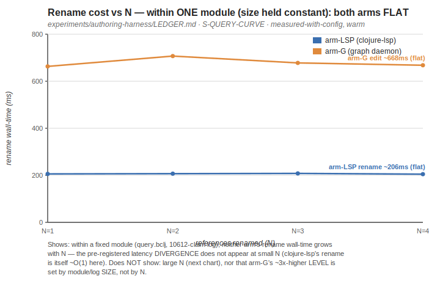
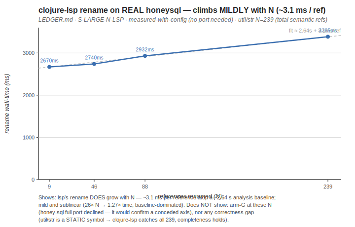
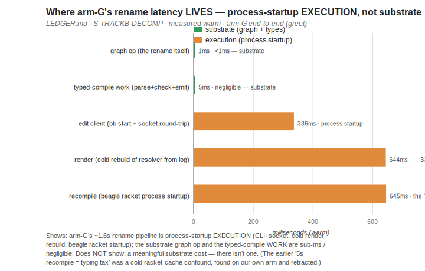
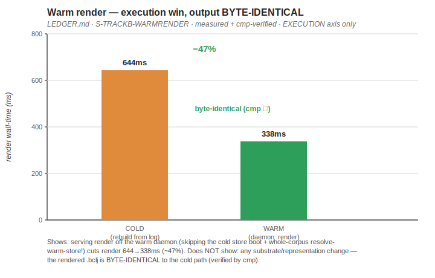

# The Authoring-Harness Experiment — Executive Report

*A complete, self-contained account of the concurrent-authoring experiment: what we set out to prove, the
journey including the wrong turns, the measured results, and what is still owed. Raw material for the
RacketCon talk. Every claim is tagged at its true epistemic weight: **[measured]** (a number we recorded),
**[demonstrated]** (a structural guarantee true by construction), **[argued]** (reasoned from the code/
mechanism, not benchmarked), **[external]** (someone else's evidence).*

*Consolidated 2026-06-21 from the committed receipts: `LEDGER.md` (+ its corrections banner), `PREREGISTER.md`,
`S2-RESULTS.md`, `S3-RESULTS.md`, `CURVE-*.md`, `TIER2-PRECONDITION-VERDICT.md`, `BYTE-IDENTICAL-MEASUREMENT.md`,
and the LOOP STATUS block. Charts in `charts/` (regenerable via `gen-charts.py`). No new measurement was run to
write this.*

---

## 1. Executive summary

**What we set out to prove.** That addressing code by **identity** (a stable node id that survives edits)
beats addressing it by **position** (a name + line in a text file) for the AI-refactoring era — measured by
**reconstruction cost** as the number of references an edit touches (N) grows.

**What we actually proved.**
- **A structural guarantee, by construction [demonstrated].** An identity rename *cannot* leave a missed or
  unverified reference, and *cannot* false-hit the old name inside a string or comment. This holds regardless
  of language, type system, or what it is compared against.
- **Rename is amortized O(1) with durable identity [measured + argued].** The first rename of a binding lazily
  installs N identity edges (one-time); every later rename is O(1), and those edges survive arbitrary
  intervening edits. Text re-finds and re-edits N spellings on *every* rename — it has nowhere to keep the edge.
- **The graph's cost is its tooling, not its physics [measured].** arm-G's whole rename latency is
  process-startup execution (CLI round-trip, a cold render rebuild, beagle's racket startup). The substrate
  operation itself is sub-millisecond and the typed-compile work is negligible. We closed ~47% of the
  deletable part (warm render) without touching the representation.

**What we deliberately did NOT prove.**
- **No analyzer-level "graph catches a reference clojure-lsp misses" [measured null].** Fram's reference
  resolver is an unexpanded-surface lexical walk — it sees *exactly* the reference classes clojure-lsp sees
  (symbol, keyword, macro) and no more. The hoped-for "Tier-2 miss" does not exist at the analyzer level.
- **No large-N graph-beats-text *latency* number.** We measured the text side to N=239 on real honeysql and
  *chose not to* port honeysql far enough to measure the graph side there — because at N=239 the symbols are
  static, completeness already holds, and the point would only confirm an axis already conceded to text.

**The single honest headline.** *The graph's advantage is structural and amortized, not a stopwatch win: it
makes a rename correct-by-construction and O(1)-with-durable-identity, where text is correct-only-if-you-find-
every-spelling and pays O(N) forever. The graph's latency cost is tooling overhead (process startup), which is
engineering-closable — and we started closing it. It is **not** that the graph computes references text can't.*

---

## 2. The thesis (for a PL audience reading cold)

**Positional vs identity addressing.** A text file addresses a definition by its *spelling and location*.
Both move when you edit, so a rename means *finding every scattered spelling* of the name, and a tool that
reads the lowered/compiled form is blind to references that didn't survive lowering. Fram stores code as a
graph of triples interned to stable node identities; a reference carries `refers_to <node-id>` — **identity,
not spelling** — so a rename is one edit to one node and every reference re-points by following the edge.

**The falsifiable prediction (where it should and shouldn't matter).**
- **Local ops TIE.** Appending or inserting a *new* definition: text-position and structure-position
  coincide, so positional addressing is already adequate. We conceded these up front.
- **Relationship ops SEPARATE.** Renaming a *referenced* definition: text must reconstruct scattered
  references; identity touches one edge. The discriminator is **reconstruction cost** — the price text pays
  to recover what serialization threw away.

**Two tiers, kept apart so the strong one stays clean.**
- **Tier 1 — the structural guarantee.** Identity rename can't-miss and can't-false-hit, *by construction*.
  Language- and tooling-independent. Demonstrated, not benchmarked.
- **Tier 2 — a combined empirical advantage** over the strongest realistic text tooling (the real
  `clojure-lsp` rename). This blends addressing with type-driven dynamism, and it is the tier that has to be
  *measured* to count.

**Second pillar [external].** CODESTRUCT (2025) found LLMs zero-shot drove a structured AST action space over
named entities and beat text/diff — scope-grounding aligns with model reasoning. So identity addressing is
both the better substrate and the better agent interface.

---

## 3. The journey, in order — including the wrong turns

*The corrections below are not blemishes. Each one is a confound we caught on our **own** numbers; together
they are the evidence the rest is honest. They are narrated as: what we believed → what caught it → what we
corrected it to.*

### Beat 1 — S2: prove the mechanism is real (write-side) [demonstrated]
- **Asked:** does an edit actually source from the graph, with the `.bclj` text a downstream *view* — or is
  the "graph arm" secretly editing text?
- **Did:** two falsifiable checks. (A) Delete the source `.bclj`; the module still renders + recompiles from
  the claim log alone. (B) A graph rename reads zero `.bclj`, commits as claims, re-points the reference by
  identity, and the regenerated code recompiles with 0 errors + passes an agent-blind behavioral oracle.
- **Meant:** the canonical artifact is the graph; the text is a projection. The first land-mine — "a graph
  arm that's really a text arm" — is dead **by construction**, not by assertion.

### Beat 2 — S3: first measured op on real code [measured]
- **Asked / predicted:** rename on real code (hiccup.util) at the floor (N=1) — predicted a tie (one
  reference; nothing to reconstruct yet).
- **Measured:** both arms green on hiccup's own test; near-tie at N=1. The predicted floor.
- **Meant:** the method works end-to-end on real code, and the floor behaves as the physics predicts.

### Beat 3 — the curve, and the FIRST wrong turn (the warm-graph-vs-cold-lsp flatter) [measured + corrected]
- **Believed (draft):** at N=1 the arms were "comparable" on latency.
- **What caught it:** the draft had compared a **warm** graph op against a **cold** clojure-lsp CLI
  invocation. That flatters the graph — a cold-vs-warm confound.
- **Corrected to:** warm-vs-warm. clojure-lsp is a GraalVM native binary; warm it renames in ~114ms, while
  arm-G's edit is ~334ms. **The graph LOSES ~2.9× at the floor**, reported straight. *(This confound — caught
  here on our own arm at the very start — is the one we then re-recognized later, pointing the other way; see
  Beat 6.)*
- **Then the curve itself** (chart 1): within ONE module (size held constant), both arms are **flat in N**
  across N=1..4 — clojure-lsp's rename is itself ~O(1) here, so the pre-registered latency *divergence* does
  not appear at small N. And arm-G's higher *level* tracks **module/log size, not N** (539-claim log → 334ms;
  3098 → 397ms; 10612 → 668ms). The "graph loses" is a constant factor set by tooling, not a curve.

### Beat 4 — the amortization finding (the footnote that became the headline) [measured + code-grounded]
- **Asked:** the rename's claim-log grows by ~N per rename. Is that a redundant index rewrite that contradicts
  "re-points for free"?
- **Measured:** the N extra claims are **`bound_to` (durable identity) installs**, not index churn. Three
  sequential renames of one binding: Δ = **6, then 2, then 2.** The first rename lazily pins N references to
  the binding's identity (O(N) once); every later rename is O(1). Pins **survive intervening edits** (verified:
  unrelated renames + a re-render between, then re-rename → still Δ=2).
- **Meant:** "re-points for free" was imprecise. The honest, stronger form: **rename is amortized O(1) after a
  one-time identity install, and the install is the durable edge text has no slot for.** Text pays O(N) writes
  every rename forever; the graph pays O(N) once, then O(1).

### Beat 5 — the SECOND wrong turn: the analyzer-Tier-2 that came back null [measured null + argued]
- **Believed:** the graph would catch references clojure-lsp misses (dynamic/keyword/macro) — a measured Tier-2.
- **What caught it:** reading the resolver. `refers_to` is a **confirmed unexpanded-surface lexical walk**
  (`syntax->datum`, zero macroexpand). So the graph sees *exactly* clojure-lsp/clj-kondo's reference classes —
  symbol, keyword, macro alike — and **no more**. Then a falsifier: we drove the real clojure-lsp server and
  it **refuses to rename an unqualified keyword** ("only namespaced keywords can be renamed") while it renames
  vars and namespaced keywords completely.
- **Corrected to:** there is **no analyzer-level Tier-2** — no reference class the graph computes that lsp
  lacks. (Scoped to *this implementation*, not a theorem: a graph that materialized post-expansion edges
  *would* see more; this one doesn't, because it sources the surface datum.)

### Beat 6 — the THIRD wrong turn killed before it cost a build: the keyword-rename path (ii) [argued]
- **Believed:** the keyword-refusal was a real graph win — the graph could rename the unqualified keyword the
  graph "understands" via runtime dispatch.
- **What caught it:** the **value-is-spelling** dilemma. A Clojure keyword's spelling *is* its value. If
  `:self` is a wire contract, no rename is safe for anyone (it changes the wire value). If it's internal, the
  idiomatic fix is to namespace it and clojure-lsp renames it. The graph-only move — keep `:self` on the wire,
  show a friendly name — is *aliasing*, not the rename op. And runtime-computed dispatch defeats *computing*
  the edge, which says nothing about *renaming* the shared literal.
- **Corrected to:** path (ii) is **dead, not deferred.** We did not spend a build on it. The honest residual
  is the substrate point (Tier-1), not an analyzer win.

### Beat 7 — the large-N divergence, answered without the port [measured]
- **Asked:** does clojure-lsp's rename cost climb with N at scale, while the graph stays cheap?
- **Predicted:** flat (analysis-dominated, N-independent).
- **Measured (chart 2):** on real honeysql, clojure-lsp's rename is **~2.64s fixed + ~3.1ms per reference**,
  across N = 9, 46, 88, 239 (`util/str`'s true semantic reference count is **239**). The "flat" prediction was
  **falsified in direction** — it *does* climb — but mildly and baseline-dominated (26× N → 1.27× time). The
  graph's per-ref cost is sub-ms [measured small-N] + O(1) [mechanism].
- **Meant + the decision:** the graph is favored on the per-ref *latency* axis. **But** at N=239 `util/str` is
  a static symbol → clojure-lsp catches all 239 → completeness holds → the gap is **latency-only, in a regime
  already conceded text-favorable on correctness.** A measured N=239 graph point would *confirm a conceded
  axis*, not change the story — so we **chose not to port** honey.sql that far (the decision below).
- **The FOURTH correction (79→239):** earlier entries said "N≈79." That `79` is the count of distinct *caller
  functions*; `239` is the count of *total references* (what a rename touches). Both true; rename-N = 239. The
  stale "79" cites were reconciled.

### Beat 8 — honeysql feasibility: util GREEN, full port a deferred marathon [measured + argued]
- **Did:** ported `honey.sql.util` and ran honeysql's **own** test suite against it — **green (39 assertions,
  0 failures).** This proved the port→build→gate pipeline on real honeysql code, under a fidelity gate (a port
  counts only if it passes the original project's tests).
- **Found:** the full `honey.sql` (2858 lines) is a multi-gap beagle marathon — `^:private`, `fn-multi`,
  `extend-protocol`, syntax-quote, a `clojure.template` extern. Real beagle-hardening value, but off the talk's
  critical path. **Deferred.**

### Beat 9 — the FIFTH correction (TRACK B): the "5s typing tax" retraction [measured + corrected]
- **Believed:** arm-G's ~5s recompile "dominates end-to-end and is the typing tax (the price of types)."
- **What caught it:** decomposing it. The ~5s was a **cold racket `.zo`-cache artifact** (first beagle
  invocation compiling beagle-lib). **Warm recompile ≈ 645ms = beagle process startup**, size- and
  dialect-insensitive — so the typed-compile *work* is negligible at module scale. *This is the same
  cold-vs-warm confound class as Beat 3 — found again, on our own arm, pointing the other way.*
- **Corrected to (chart 3):** arm-G's whole rename latency is **process-startup execution** (CLI+socket, a
  cold render rebuild, beagle racket startup). The substrate graph op is sub-ms; the typing tax is negligible.
  *The graph's cost is its tooling, not its physics.*
- **Then we closed a chunk of it (chart 4):** a warm `:render` daemon op serves the projection off the warm
  store (no cold rebuild). Render **644ms → 338ms (~47%)**, output **byte-identical** (cmp-verified). Strictly
  the execution axis — never reported as a substrate number.

---

## 4. Charts

*Each is a committed SVG in `charts/` (regenerable: `python3 gen-charts.py`). Captions state what each shows
**and what it does not**.*

### 4.1 Cost vs N — both arms flat (within one module)

Within a fixed module (size constant), neither arm's rename cost grows with N over N=1..4 — the pre-registered
divergence does not appear at small N. **Does not show:** large N (next), nor that arm-G's higher level is set
by module/log size rather than N.

### 4.2 clojure-lsp rename climbs mildly with N (real honeysql, to N=239)

clojure-lsp's rename *does* grow with N — ~3.1ms/ref atop a ~2.64s analysis baseline; mild and sublinear.
**Does not show:** the graph at these N (honey.sql full port declined), nor any correctness gap (util/str is
static, so completeness holds at all 239).

### 4.3 Where arm-G's latency lives — execution, not substrate

arm-G's rename latency is process-startup execution (CLI+socket, cold render rebuild, beagle racket startup);
the substrate graph op and the typed-compile work are sub-ms/negligible. **Does not show:** a meaningful
substrate cost — there isn't one (the "5s typing tax" was a cold-cache artifact, retracted).

### 4.4 Warm render — execution win, byte-identical

Serving render off the warm daemon cuts it 644→338ms (~47%); output byte-identical. **Does not show:** any
substrate/representation change — purely an execution-layer win.

---

## 5. What separates, and what ties — the honest table

*Including the columns where the graph **loses**. A graph-wins-every-column table is the tell to distrust.*

| Axis | Graph (arm-G) | Text + clojure-lsp (arm-LSP) | Verdict |
|---|---|---|---|
| **Missed/unverified refs on rename** | none, by construction | static analysis can leave refs to verify | **graph wins — Tier-1 [demonstrated]** |
| **False-hit in string/comment** | immune by construction | also semantic-safe | **TIE vs lsp** (a Tier-1 guarantee, not a discriminator vs a *semantic* renamer) |
| **Reference classes seen** | symbol/keyword/macro (lexical surface) | symbol/keyword/macro (lexical surface) | **TIE — analyzer-Tier-2 is null [measured]** |
| **Rename write cost over a binding's life** | O(N) **once** (lazy identity install), then O(1) + durable | O(N) **every** rename (re-find + re-edit) | **graph wins — amortized [measured]** |
| **Per-ref latency at scale** | sub-ms [measured small-N + O(1) mechanism] | ~3.1ms/ref atop ~2.64s baseline, to N=239 [measured] | graph favored, but *latency-only* in a static-symbol regime |
| **Rename op wall-time at the floor (warm-vs-warm)** | ~334ms | ~114ms | **graph LOSES ~2.9×** (execution overhead) [measured] |
| **End-to-end latency** | ~1.4s warm (mostly process startup) | fast (in-memory) | **graph LOSES** — but it's tooling, engineering-closable (warm render already −47%) |
| **Storage per rename** | O(N) (durable `bound_to` install) | n/a (edits in place) | graph pays storage to buy the durable edge |
| **Correctness completeness on static symbols** | complete | complete | **TIE** (the honeysql ceiling) |

**The shape of the honest claim:** the graph trades *latency it can engineer away* for *correctness it has by
construction* and *amortized-O(1) renames with a durable identity edge text cannot keep*. It does not out-
*compute* the text analyzer.

---

## 6. Lessons learned

**Technical.**
- Identity addressing's real, defensible win is **structural** (can't-miss/can't-false-hit) and **amortized**
  (O(1)+durable rename), not a stopwatch number.
- A lexical-surface resolver sees exactly what a lexical-surface analyzer sees. To beat clojure-lsp on
  *completeness* you must materialize edges *beyond* the lexical walk — a build, not a measurement.
- arm-G's latency is tooling/process-startup, not substrate. The graph operation is sub-ms; warm processes
  collapse the rest.

**Methodological — the discipline that makes the numbers believable.**
- **Pre-register before measuring.** Predictions were committed before numbers; the arrow points
  prediction → measurement, never the reverse.
- **Distrust the clean number.** Every confound we caught was on a result we *wanted*: warm-graph-vs-cold-lsp
  (Beat 3) and the "5s typing tax" (Beat 9) were the same cold-vs-warm error, caught twice on our own arm.
- **Attribute every loss to a named layer.** "The graph loses" became "the graph loses *the CLI round-trip and
  beagle startup*," which is closable, not "the substrate is slow," which would be false.
- **An honest FALSE is a result.** The analyzer-Tier-2 null and the latency floor where the graph loses are
  reported as findings, not buried.
- **Don't let "hero's journey" sand off the wrong turns.** The corrections *are* the credibility.

---

## 7. The frontier — measured vs still owed

**Measured / demonstrated (banked):** Tier-1 structural guarantee; amortized-O(1)+durable rename; cost-vs-N
flat at small N; arm-LSP ~3.1ms/ref to N=239; arm-G latency is execution; warm render −47% byte-identical;
honey.sql.util port gate-green.

**Still owed (chosen, not failed):**
- **The large-N graph latency point.** Not ported-for, on purpose — at N=239 it would confirm a conceded
  (static-symbol, completeness-holds) axis. Owed only if the talk wants the curve drawn on the graph side too.
- **The materialize-beyond-lexical question** (the only path to a *measured* analyzer Tier-2): could a graph
  that reifies dispatch/expansion edges catch a class lsp structurally misses? That requires **building new
  materialization** (not measuring existing behavior) — reserved for the outer loop / a future arc.

**Beagle-hardening list (off the talk's critical path; pick up only to make Fram faster to use):**
`fram-edit-code` lazy-load (~236ms, hot-path surgery); persistent beagle process (~645ms startup) + persistent
racket renderer (~263ms); the full `honey.sql` port (needs `fn-multi`, `^:private`, `extend-protocol`,
syntax-quote, `clojure.template` externs).

---

*End of report. The measured story is complete and honest at every epistemic weight — which was the whole job.*
